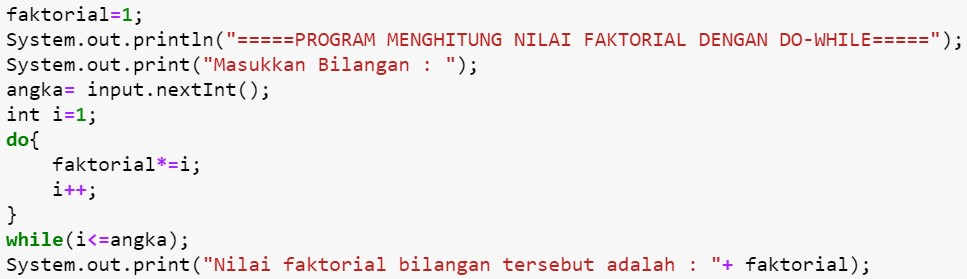
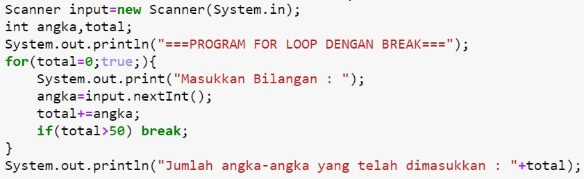
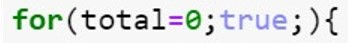

## JOBSHEET 7

## PERULANGAN 1

### Tujuan

Mahasiswa mampu menyelesaikan permasalahan/studi kasus menggunakan sintaks perulangan 1 dan mengimplemantasikannya dalam bahasa pemrogaman java.

### Alat dan Bahan
+ PC/laptop
+ Browser(chrome, firefox, safari)
+ Koneksi internet

### Praktikum

#### Percobaan 1 : Penggunaan for, while dan do-while

#### Waktu percobaan : 40 menit

1. Perhatikan flowchart perulangan for dibawah ini!

    <p align="left">
    
    </p>
    

> Flowchart diatas digunakan untuk menghitung nilai faktorial, selanjutnya kita akan membuat programnya berdasarkan
> flowchart di atas!

2. Tambahkan library Scanner, deklarasi Scanner, dan buat variabel angka untuk menampung data yang diinput melalui keyboard


```Java
// Ketik kode program di bawah sini
import java.util.Scanner;
Scanner s = new Scanner(System.in);
```

3. Buatlah deklarasi dan inisialisasi variabel faktorial sesuai dengan flowchart diatas


```Java
// Ketik kode program di bawah sini
int angka, faktorial = 1;
```

4. Tambahkan struktur perulangan untuk menghitung hasil faktorial sebuah nilai yang diinputkan menggunakan for
    
    <p align="left">
    
    </p>


```Java
// Ketik kode program di atas di bawah sini
angka = s.nextInt();
for(int i = 1; i <= angka; i++){
    faktorial *= i;
}
System.out.println("Nilai "+angka+" faktorial adalah : " + faktorial);
```

    4
    Nilai 4 faktorial adalah : 24
    

5. Ubah nilai variabel faktorial seperti semula. Kemudian gunakan struktur perulangan while untuk menghitung hasil faktorial sebuah nilai yang diinputkan
    
    <p align="left">
    
    </p>


```Java
// Ketik kode program di atas di bawah sini

```

6. Kembalikan lagi nilai variabel faktorial seperti semula. Gunakan struktur perulangan do-while untuk menghitung hasil faktorial sebuah nilai yang diinputkan
    
    <p align="left">
    
    </p>


```Java
// Ketik kode program di atas di bawah sini

```

##### Pertanyaan
1. Pada program diatas, apakah kegunaan baris berikut?
<p align="left">
    
    </p>


```Java
// Ketik jawaban disini

```

2. Modifikasi program diatas dibagian struktur pemilihannya sehingga hasilnya menjadi seperti di bawah ini:
<p align="left">
    
    </p>


```Java
// Ketik kode program di atas di bawah sini
import java.util.Scanner;
Scanner s = new Scanner(System.in);
System.out.print("Masukkan bilangan: ");
int angka = s.nextInt();
System.out.print(angka+"Faktorial = ");
int f = 1;
int i;
for(i = 1; i <= angka; i++){
    f *= i;
    System.out.print(i);
    System.out.print("x");
}
System.out.print(" = " + f);
```

    Masukkan bilangan: 5
    5Faktorial = 1x2x3x4x5x = 120

#### Percobaan 2 : Keluar dari perulangan menggunakan break

#### Waktu percobaan : 40 menit

1. Buatlah perulangan dengan menggunakan for yang memanfaatkan keyword break
<p align="left">
    
    </p>


```Java
// Ketik kode program di atas di bawah sini

```

2. Buat perulangan yang sama dengan struktur perulangan while
<p align="left">
    
    </p>


```Java
// Ketik kode program di atas di bawah sini

```

3. Tuliskan perulangan diatas dalam struktur do-while
    <p align="left">
    
    </p>


```Java
// Ketik kode program di atas di bawah sini

```

##### Pertanyaan
1. Jelaskan fungsi kode program yang telah dibuat pada percobaan diatas!


```Java
// Ketik jawaban disini

```

2. Jelaskan fungsi kode berikut!
    <p align="left">
    
    </p>


```Java
// Ketik jawaban disini

```

#### Percobaan 3 : Keluar dari step perulangan menggunakan continue

#### Waktu percobaan : 40 menit

1. Buat program looping menggunakan struktur perulangan for seperti di bawah ini: 
<p align="left">
    
    </p>


```Java
// Ketik kode program di atas di bawah sini

```


```Java
5. Jalankan program. Amati apa yang terjadi!
```


    Incomplete input:

    |   5. Jalankan program. Amati apa yang terjadi!


##### Pertanyaan
1. Jelaskan Perbedaan dari percobaan 2 dan percobaan 3


```Java
// Ketik jawaban disini

```

2. Jelaskan apa fungsi perintah kode program dibawah ini?
<p align="left">
    
    </p>


```Java
// Ketik jawaban disini

```

### Tugas

#### Waktu pengerjaan Tugas: 140 menit

1. Buatlah program yang meminta masukan user sebuah bilangan bulat N (N > 0). Program kemudian menampilkan penjumlahan N bilangan genap positif pertama (bilangan genap ≥ 0).
Contoh: 
    •	Jika user memasukkan N = 10, program akan menghitung banyaknya jumlah bilangan positive di dalam range bilangan 1-10   kemudian menampilkan penjumlahan bilangan positive bilangan bilangan diantara 1-10 yaitu : 
        0 + 2 + 4 + 6 + 10 = 30. 
        Setelah itu program akan menampilkan rata-rata dari bilangan positive yang telah dijumlahkan tadi.
    •	Contoh output program dan flowchart
<br/><br/>
  

<br/>


```Java
// Ketik kode program disini

```

2. Buatlah program untuk menampilkan angka 1 hingga angka masukan pengguna secara berurutan dan melompati angka kelipatan 5. Seperti tampilan di bawah ini
<p align="left">

</p>


```Java
// Ketik kode program disini
```

3. Buatlah sebuah program yang menampilkan deret bilangan fibonacci sebagai berikut. Dimana bilangan yang terletak di sebelah kanan adalah hasil penjumlahan dari 2 bilangan sebelumnya
 <p align="left">
    
    </p>


```Java
// Ketik kode program disini
```
