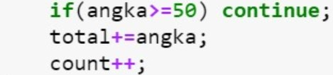

## JOBSHEET 7

## PERULANGAN 1

### Tujuan

Mahasiswa mampu menyelesaikan permasalahan/studi kasus menggunakan sintaks perulangan 1 dan mengimplemantasikannya dalam bahasa pemrogaman java.

### Alat dan Bahan
+ PC/laptop
+ Browser(chrome, firefox, safari)
+ Koneksi internet

### Praktikum

#### Percobaan 1 : Penggunaan for, while dan do-while

#### Waktu percobaan : 40 menit

1. Perhatikan flowchart perulangan for dibawah ini!

    <p align="left">
    
    </p>
    

> Flowchart diatas digunakan untuk menghitung nilai faktorial, selanjutnya kita akan membuat programnya berdasarkan
> flowchart di atas!

2. Tambahkan library Scanner, deklarasi Scanner, dan buat variabel angka untuk menampung data yang diinput melalui keyboard


```Java
// Ketik kode program di bawah sini
import java.util.Scanner;
Scanner input = new Scanner(System.in);
```

3. Buatlah deklarasi dan inisialisasi variabel faktorial sesuai dengan flowchart diatas


```Java
// Ketik kode program di bawah sini
int angka;
int faktorial = 1
```

4. Tambahkan struktur perulangan untuk menghitung hasil faktorial sebuah nilai yang diinputkan menggunakan for
    
    <p align="left">
    
    </p>


```Java
// Ketik kode program di atas di bawah sini
System.out.println("====PROGAM MENGHITUNG NILAI FAKTORIAL DENGAN FOR====");
System.out.print("Masukkan Bilangan : ");
angka= input.nextInt();
for(int i=1; i<=angka; i++)
    faktorial*=i;
System.out.print("Nilai faktorial bilanagn tersebut adalah : "+ faktorial);
```

    ====PROGAM MENGHITUNG NILAI FAKTORIAL DENGAN FOR====
    Masukkan Bilangan : 6
    Nilai faktorial bilanagn tersebut adalah : 720

5. Ubah nilai variabel faktorial seperti semula. Kemudian gunakan struktur perulangan while untuk menghitung hasil faktorial sebuah nilai yang diinputkan
    
    <p align="left">
    
    </p>


```Java
// Ketik kode program di atas di bawah sini
faktorial=1;
System.out.println("====PROGAM MENGHITUNG NILAI FAKTORIAL DENGAN WHILE");
System.out.print("Masukkan Bilangan : ");
angka=input.nextInt();
int i=1;
while (i<=angka){
    faktorial*=i;
    i++;
}
System.out.print("Nilai faktorial bilangan tersebut adalah : "+ faktorial);
```

    ====PROGAM MENGHITUNG NILAI FAKTORIAL DENGAN WHILE
    Masukkan Bilangan : 6
    Nilai faktorial bilangan tersebut adalah : 720

6. Kembalikan lagi nilai variabel faktorial seperti semula. Gunakan struktur perulangan do-while untuk menghitung hasil faktorial sebuah nilai yang diinputkan
    
    <p align="left">
    
    </p>


```Java
// Ketik kode program di atas di bawah sini
faktorial=1;
System.out.println("====PROGAM MENGHITUNG NILAI FAKTORIAL DENGAN DO-WHILE====");
System.out.print("Masukkan Bilangan : ");
angka=input.nextInt();
int i=1;
do{
    faktorial*=i;
    i++;
}
while(i<=angka);
System.out.println("Nilai faktorial bilanagan tersebut adalah : "+ faktorial);
```

    ====PROGAM MENGHITUNG NILAI FAKTORIAL DENGAN DO-WHILE====
    Masukkan Bilangan : 6
    Nilai faktorial bilanagan tersebut adalah : 720
    

##### Pertanyaan
1. Pada program diatas, apakah kegunaan baris berikut?
<p align="left">
    
    </p>

// Ketik jawaban disini

untuk meberikan perintah bahwa variabel faktorial dioperasikan perkalian dengan perulangan bilangan yang diinputkan


2. Modifikasi program diatas dibagian struktur pemilihannya sehingga hasilnya menjadi seperti di bawah ini:
<p align="left">
    
    </p>


```Java
// Ketik kode program di atas di bawah sini
import java.util.Scanner;
Scanner input = new Scanner(System.in);
faktorial = 1;
System.out.println("====PROGAM MENGHITUNG NILAI FAKTORIAL====");
System.out.print("Masukkan Bilangan : ");
angka= input.nextInt();
int i = 1;
System.out.print(angka+"Faktorial: ");
for (i=1; i<=angka; i++){
    faktorial*=i;
        if(i==angka){
            System.out.print(i);
        }else{
            System.out.print(i+"x");
        }
    }
System.out.println("="+faktorial);
```

    ====PROGAM MENGHITUNG NILAI FAKTORIAL====
    Masukkan Bilangan : 5
    5Faktorial: 1x2x3x4x5=120
    

# Percobaan 2 : Keluar dari perulangan menggunakan break

#### Waktu percobaan : 40 menit

1. Buatlah perulangan dengan menggunakan for yang memanfaatkan keyword break
<p align="left">
    
    </p>


```Java
// Ketik kode program di atas di bawah sini
Scanner input = new Scanner(System.in);
int angka,total;
System.out.println("===PROGAM FOR LOOP DENGAN BREAK");
for(total=0;true;){
    System.out.println("Masukkan Bilangan : ");
    angka=input.nextInt();
    total+=angka;
    if(total>50) break;
}
System.out.println("Jumlah angka-angka yang telah dimasukkan : "+ total);
```

    ===PROGAM FOR LOOP DENGAN BREAK
    Masukkan Bilangan : 
    5
    Masukkan Bilangan : 
    5
    Masukkan Bilangan : 
    5
    Masukkan Bilangan : 
    60
    Jumlah angka-angka yang telah dimasukkan : 75
    

2. Buat perulangan yang sama dengan struktur perulangan while
<p align="left">
    
    </p>


```Java
// Ketik kode program di atas di bawah sini
int angka,total;
System.out.println("===PROGAM FOR LOOP DENGAN BREAK");
total=0;
while(true){
    System.out.println("Masukkan Bilangan : ");
    angka=input.nextInt();
    total+=angka;
    if(total>50) break;
}
System.out.println("Jumlah angka-angka yang telah dimasukkan : "+ total);
```

    ===PROGAM FOR LOOP DENGAN BREAK
    Masukkan Bilangan : 
    5
    Masukkan Bilangan : 
    5
    Masukkan Bilangan : 
    5
    Masukkan Bilangan : 
    60
    Jumlah angka-angka yang telah dimasukkan : 75
    

3. Tuliskan perulangan diatas dalam struktur do-while
    <p align="left">
    
    </p>


```Java
// Ketik kode program di atas di bawah sini
int angka,total;
System.out.println("===PROGAM D0-WHILE LOOP DENGAN BREAK===");
total=0;
do
{
    System.out.println("Masukkan Bilangan : ");
    angka=input.nextInt();
    total+=angka;
    if(total>50) break;
}
while(true);
System.out.println("Jumlah angka-angka yang telah dimasukkan : "+ total);
```

    ===PROGAM D0-WHILE LOOP DENGAN BREAK===
    Masukkan Bilangan : 
    5
    Masukkan Bilangan : 
    5
    Masukkan Bilangan : 
    5
    Masukkan Bilangan : 
    60
    Jumlah angka-angka yang telah dimasukkan : 75
    

##### Pertanyaan
1. Jelaskan fungsi kode program yang telah dibuat pada percobaan diatas!

// Ketik jawaban disini

Kode progam break berfungsi untuk keluar dari perulangan

2. Jelaskan fungsi kode berikut!
    <p align="left">
    
    </p>


// Ketik jawaban disini

for merupakan format kode progam perulangan dimana variabel total berfungsi menyimpan total pengulangan, true menandakan boolean yang akan dieksekusi apabila nilai yang dimaksudkan benar

#### Percobaan 3 : Keluar dari step perulangan menggunakan continue

#### Waktu percobaan : 40 menit

1. Buat program looping menggunakan struktur perulangan for seperti di bawah ini: 
<p align="left">
    
    </p>


```Java
// Ketik kode program di atas di bawah sini
Scanner input=new Scanner(System.in);
int angka, total, count;
double avg;
count=0;
System.out.println("===PROGAM FOR LOOP DENGAN CONTINUE===");
for(int i=0;i<5;i++){
    System.out.println("Masukkan Bilangan : ");
    angka=input.nextInt();
    if(angka>50) continue;
    total+=angka;
    count++;
}
System.out.println("Jumlah angka-angka yang kurang dari 50: "+total);
avg=(double)total/count;
System.out.println("Rata-rata angka yang kurang dari 50: "+avg);
```

    ===PROGAM FOR LOOP DENGAN CONTINUE===
    Masukkan Bilangan : 
    5
    Masukkan Bilangan : 
    5
    Masukkan Bilangan : 
    5
    Masukkan Bilangan : 
    60
    Masukkan Bilangan : 
    10
    Jumlah angka-angka yang kurang dari 50: 25
    Rata-rata angka yang kurang dari 50: 6.25
    

5. Jalankan program. Amati apa yang terjadi!

##### Pertanyaan
1. Jelaskan Perbedaan dari percobaan 2 dan percobaan 3

// Ketik jawaban disini

Pada percobaan 2 menggunakan break dimana apabila menggunakan kode progam tersebut menghentikan paksa dari perulangan dan apabila ada kondisi selanjutnya maka tidak akan dieksekusi sedangkan pada percobaan 3 menggunakan continue dimana pada kode progam tersebut akan dilewati namun tetap bisa melanjutkan perulangan apabila ada kondisi selanjutnya yang memenuhi syarat

2. Jelaskan apa fungsi perintah kode program dibawah ini?
<p align="left">
    
    </p>

// Ketik jawaban disini

if merupakan kondisi pemilihan dimana apabila nilai variabel memenuhi lebih dari 50 maka tidak akan dieksekusi atau dilewati atau progam akan lanjut ke kode progam selanjutnya
variabel total akan dioperasikan dengan penjumlahan pada angka-angka yang dimasukkan 
count ++ berguna untuk menghitung jumlah angka yang dimasukkan


### Tugas

#### Waktu pengerjaan Tugas: 140 menit

1. Buatlah program yang meminta masukan user sebuah bilangan bulat N (N > 0). Program kemudian menampilkan penjumlahan N bilangan genap positif pertama (bilangan genap ≥ 0).
Contoh: 
    •	Jika user memasukkan N = 10, program akan menghitung banyaknya jumlah bilangan positive di dalam range bilangan 1-10   kemudian menampilkan penjumlahan bilangan positive bilangan bilangan diantara 1-10 yaitu : 
        0 + 2 + 4 + 6 + 10 = 30. 
        Setelah itu program akan menampilkan rata-rata dari bilangan positive yang telah dijumlahkan tadi.
    •	Contoh output program dan flowchart
<br/><br/>
  

<br/>


```Java
// Ketik kode program disini
Scanner input=new Scanner(System.in);
int bil, jmlBilGenap;
double avg;
int totalGenap=0;

System.out.print("Masukkan bilangan genap : ");
bil=input.nextInt();
jmlBilGenap=bil/2;
System.out.print("Banyaknya bilangan genap dari 1 sampai " +bil +" adalah "+jmlBilGenap);
System.out.print("\nangka genap dalam range tersebut adalah ");
for (i=1;i<=bil;i++){
    if(i%2!=0){
       continue;
    }else{
        if(i ==bil){
            System.out.print(i);
        }else {
         if (bil%2==0){
            System.out.print(i +", ");
        }else {
            System.out.print(i);
        }
    }
    totalGenap +=i;
 }
}
    avg=totalGenap/jmlBilGenap;
    System.out.println("\nhasil penjumlahan bilangan genap dari 1 sampai "+bil +" adalah " +totalGenap);
    System.out.println("Rata-rata bilangan genap dari 1 sampai "+bil +" adalah " +avg);

  
```

    Masukkan bilangan genap : 10
    Banyaknya bilangan genap dari 1 sampai 10 adalah 5
    angka genap dalam range tersebut adalah 2, 4, 6, 8, 10
    hasil penjumlahan bilangan genap dari 1 sampai 10 adalah 30
    Rata-rata bilangan genap dari 1 sampai 10 adalah 6.0
    

2. Buatlah program untuk menampilkan angka 1 hingga angka masukan pengguna secara berurutan dan melompati angka kelipatan 5. Seperti tampilan di bawah ini
<p align="left">

</p>


```Java
// Ketik kode program disini
Scanner input=new Scanner(System.in);
int bil;
System.out.print("Masukkan Angka : ");
bil=input.nextInt();
for (i=1;i<=bil;i++){
    if(i%5==0)continue;
    System.out.println(i);
}
```

    Masukkan Angka : 19
    1
    2
    3
    4
    6
    7
    8
    9
    11
    12
    13
    14
    16
    17
    18
    19
    

3. Buatlah sebuah program yang menampilkan deret bilangan fibonacci sebagai berikut. Dimana bilangan yang terletak di sebelah kanan adalah hasil penjumlahan dari 2 bilangan sebelumnya
 <p align="left">
    
    </p>


```Java
import java.util.Scanner;
Scanner input = new Scanner(System.in);
int bil,a,b,c;
System.out.print("Masukkan deret bilangan: ");
bil = input.nextInt();
 a=0;
 b=1;
 c=1;
for(i=0;i<=bil;i++){
    c=a+b;
    System.out.println("Sum Of: "+a + "+" +b + "=" +c);
    a=b;
    b=c;
    
}
```

    Masukkan deret bilangan: 10
    Sum Of: 0+1=1
    Sum Of: 1+1=2
    Sum Of: 1+2=3
    Sum Of: 2+3=5
    Sum Of: 3+5=8
    Sum Of: 5+8=13
    Sum Of: 8+13=21
    Sum Of: 13+21=34
    Sum Of: 21+34=55
    Sum Of: 34+55=89
    Sum Of: 55+89=144
    


```Java

```


```Java

```
