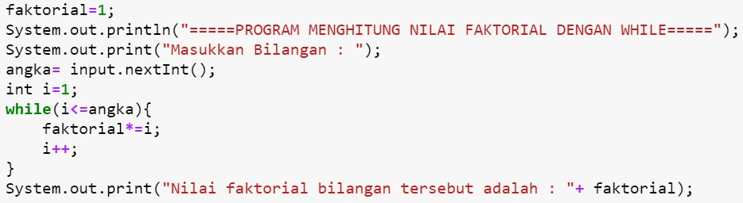
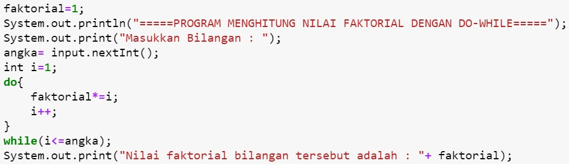
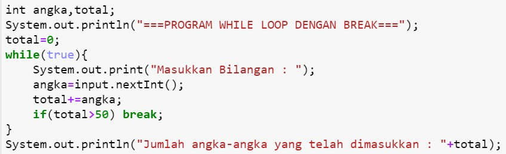
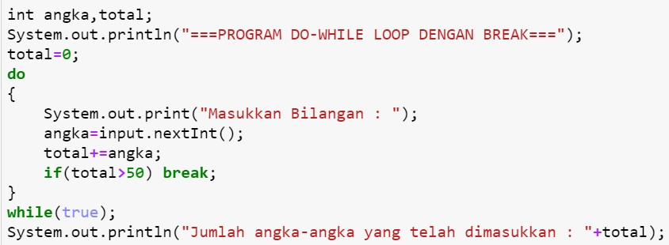
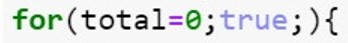
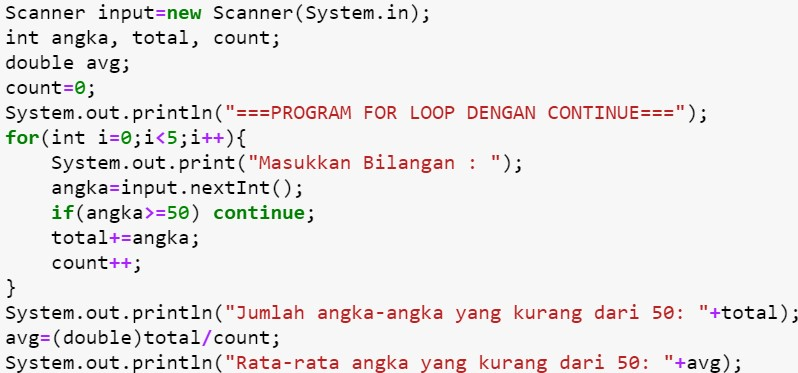
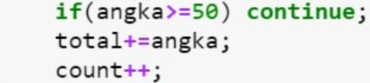
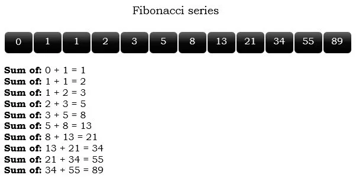

## NAMA : WIRASWANTI RISMANDA PUTRI

## NIM :2131710021

## JOBSHEET 7

## PERULANGAN 1

### Tujuan

Mahasiswa mampu menyelesaikan permasalahan/studi kasus menggunakan sintaks perulangan 1 dan mengimplemantasikannya dalam bahasa pemrogaman java.

### Alat dan Bahan
+ PC/laptop
+ Browser(chrome, firefox, safari)
+ Koneksi internet

### Praktikum

#### Percobaan 1 : Penggunaan for, while dan do-while

#### Waktu percobaan : 40 menit

1. Perhatikan flowchart perulangan for dibawah ini!

    <p align="left">
    
    </p>
    

> Flowchart diatas digunakan untuk menghitung nilai faktorial, selanjutnya kita akan membuat programnya berdasarkan
> flowchart di atas!

2. Tambahkan library Scanner, deklarasi Scanner, dan buat variabel angka untuk menampung data yang diinput melalui keyboard


```Java
// Ketik kode program di bawah sini
import java.util.Scanner;
Scanner input = new Scanner(System.in);
```

3. Buatlah deklarasi dan inisialisasi variabel faktorial sesuai dengan flowchart diatas!


```Java
// Ketik kode program di bawah sini
int angka, faktorial=1;
```

4. Tambahkan struktur perulangan untuk menghitung hasil faktorial sebuah nilai yang diinputkan menggunakan for
    
    <p align="left">
    
    </p>


```Java
// Ketik kode program di atas di bawah sini
System.out.println("=====PROGRAM MENGHITUNG NILAI FAKTORIAL DENGAN FOR=====");
System.out.print("Masukkan Bilangan : ");
angka= input.nextInt();
for(int i=1; i<=angka; i++){
    faktorial*=i;
}
System.out.print("Nilai faktorial bilangan tersebut adalah : "+ faktorial);
```

    =====PROGRAM MENGHITUNG NILAI FAKTORIAL DENGAN FOR=====
    Masukkan Bilangan : 5
    Nilai faktorial bilangan tersebut adalah : 120

5. Ubah nilai variabel faktorial seperti semula. Kemudian gunakan struktur perulangan while untuk menghitung hasil faktorial sebuah nilai yang diinputkan
    
    <p align="left">
    
    </p>


```Java
// Ketik kode program di atas di bawah sini
faktorial=1;
System.out.println("=====PROGRAM MENGHITUNG NILAI FAKTORIAL DENGAN WHILE=====");
System.out.print("Masukkan Bilangan : ");
angka= input.nextInt();
int i=1;
while(i<=angka){
    faktorial*=i;
    i++;
}
System.out.print("Nilai faktorial bilangan tersebut adalah : "+ faktorial);
```

    =====PROGRAM MENGHITUNG NILAI FAKTORIAL DENGAN WHILE=====
    Masukkan Bilangan : 5
    Nilai faktorial bilangan tersebut adalah : 120

6. Kembalikan lagi nilai variabel faktorial seperti semula. Gunakan struktur perulangan do-while untuk menghitung hasil faktorial sebuah nilai yang diinputkan
    
    <p align="left">
    
    </p>


```Java
// Ketik kode program di atas di bawah sini
faktorial=1;
System.out.println("=====PROGRAM MENGHITUNG NILAI FAKTORIAL DENGAN DO-WHILE=====");
System.out.print("Masukkan Bilangan : ");
angka= input.nextInt();
int i=1;
do{
    faktorial*=i;
    i++;
}
while(i<=angka);
System.out.print("Nilai faktorial bilangan tersebut adalah : "+ faktorial);
```

    =====PROGRAM MENGHITUNG NILAI FAKTORIAL DENGAN DO-WHILE=====
    Masukkan Bilangan : 5
    Nilai faktorial bilangan tersebut adalah : 120

##### Pertanyaan
1. Pada program diatas, apakah kegunaan baris berikut?
<p align="left">
    
    </p>

#### Jawab
Fungsi program faktorial*=i adalah sebagai operator assignment yang digunakan untuk memberikan sebuah nilai ke sebuah variabel. Yang pada program diatas tertulis faktorial*=i ekuivalen dengan faktorial = faktorial*i


2. Modifikasi program diatas dibagian struktur pemilihannya sehingga hasilnya menjadi seperti di bawah ini:
<p align="left">
    
    </p>


```Java
// Ketik kode program di atas di bawah sini
faktorial = 1;
System.out.println("=====PROGRAM MENGHITUNG NILAI FAKTORIAL DENGAN FOR=====");
System.out.print("Masukan Bilangan : ");
angka = input.nextInt();
int i =1 ;
System.out.print(angka + "Faktorial = " );
for(i = 1;i <= angka  ; i++){
    faktorial *= i;
    if(i == angka){
        System.out.print(i);
    }else{
        System.out.print(i + "x");
    }
}
System.out.println(" = " + faktorial);
```

    =====PROGRAM MENGHITUNG NILAI FAKTORIAL DENGAN FOR=====
    Masukan Bilangan : 5
    5Faktorial = 1x2x3x4x5 = 120
    

#### Percobaan 2 : Keluar dari perulangan menggunakan break

#### Waktu percobaan : 40 menit

1. Buatlah perulangan dengan menggunakan for yang memanfaatkan keyword break
<p align="left">
    
    </p>


```Java
// Ketik kode program di atas di bawah sini
Scanner input= new Scanner(System.in);
int angka,total;
System.out.println("===PROGRAM FOR LOOP DENGAN BREAK===");
for(total=0;true;){
    System.out.print("Masukkan Bilangan : ");
    angka=input.nextInt();
    total+=angka;
    if(total>50) break;
}
System.out.println("Jumlah angka-angka yang telah dimasukkan : "+ total);
```

    ===PROGRAM FOR LOOP DENGAN BREAK===
    Masukkan Bilangan : 10
    Masukkan Bilangan : 25
    Masukkan Bilangan : 30
    Jumlah angka-angka yang telah dimasukkan : 65
    

2. Buat perulangan yang sama dengan struktur perulangan while
<p align="left">
    
    </p>


```Java
// Ketik kode program di atas di bawah sini
int angka,total;
System.out.println("===PROGRAM WHILE LOOP DENGAN BREAK===");
total=0;
while(true){
    System.out.print("Masukkan Bilangan : ");
    angka=input.nextInt();
    total+=angka;
    if(total>50) break;   
}
System.out.println("Jumlah angka-angka yang telah dimasukkan : "+ total);
```

    ===PROGRAM WHILE LOOP DENGAN BREAK===
    Masukkan Bilangan : 10
    Masukkan Bilangan : 25
    Masukkan Bilangan : 30
    Jumlah angka-angka yang telah dimasukkan : 65
    

3. Tuliskan perulangan diatas dalam struktur do-while
    <p align="left">
    
    </p>


```Java
// Ketik kode program di atas di bawah sini
int angka, total;
System.out.println("===PROGRAM DO-WHILE LOOP DENGAN BREAK===");
total=0;
do
{
    System.out.print("Masukkan Bilangan : ");
    angka=input.nextInt();
    total+=angka;
    if(total>50) break;
}
while(true);
System.out.println("Jumlah angka-angka yang telah dimasukkan "+ total);
```

    ===PROGRAM DO-WHILE LOOP DENGAN BREAK===
    Masukkan Bilangan : 10
    Masukkan Bilangan : 25
    Masukkan Bilangan : 30
    Jumlah angka-angka yang telah dimasukkan 65
    

##### Pertanyaan
1. Jelaskan fungsi kode program yang telah dibuat pada percobaan diatas!

#### Jawab
Fungsi kode program pernyataan break digunakan untuk menghentikan paksa perulangan dan kode diluar perulangan yang akan dieksekusi, yaitu keluar dari perulangan (for, while dan do-while). Jika total semua angka yang telah diinput sudah lebih dari 50 otomatis kode program akan berhenti.

2. Jelaskan fungsi kode berikut!
    <p align="left">
    
    </p>


#### Jawab 
Fungsi dari kode di atas adalah untuk terus menjalankan perulangan selama syarat perulangan masih bernilai TRUE.

#### Percobaan 3 : Keluar dari step perulangan menggunakan continue

#### Waktu percobaan : 40 menit

1. Buat program looping menggunakan struktur perulangan for seperti di bawah ini: 
<p align="left">
    
    </p>


```Java
// Ketik kode program di atas di bawah sini
Scanner input = new Scanner(System.in);
int angka, total, count;
double avg;
count=0;
System.out.println("===PROGRAM FOR LOOP DENGAN CONTINUE===");
for(int i=0; i<5; i++){
    System.out.print("Masukkan Bilangan : ");
    angka=input.nextInt();
    if(angka>=50) continue;
    total+=angka;
    count++;
}
System.out.println("Jumlah angka-angka yang kurang dari 50: "+total);
avg=(double)total/count;
System.out.println("Rata-rata angka yang kurang dari 50: "+ avg);
```

    ===PROGRAM FOR LOOP DENGAN CONTINUE===
    Masukkan Bilangan : 10
    Masukkan Bilangan : 25
    Masukkan Bilangan : 30
    Masukkan Bilangan : 60
    Masukkan Bilangan : 45
    Jumlah angka-angka yang kurang dari 50: 110
    Rata-rata angka yang kurang dari 50: 27.5
    

5. Jalankan program. Amati apa yang terjadi!

#### Jawab
Yang terjadi pada program tersebut jika ditambahkan statement Continue adalah hasil outputnya hanya akan ditambahkan input angka yang kurang dari sama dengan 50 saja yaitu 10, 25, 30, 45 dan kemudian dihitung rata-ratanya. Jadi fungsi dari statement continue sendiri adalah untuk menghentikan perulangan yang saat ini terjadi (1 iterasi saja) kemudian melanjutkan perulangan pada iterasi berikutnya atau bisa disebut juga 'melewati' satu perulangan.   

##### Pertanyaan
1. Jelaskan Perbedaan dari percobaan 2 dan percobaan 3


#### Jawab
- Pada percobaan 2 menggunakan Statement Break yang fungsinya untuk menghentikan paksa perulangan dan kode diluar perulangan yang akan dieksekusi. Yang dapat dilihat pada percobaan 2 jika angka yang dimasukkan lebih dari 50 maka program otomatis akan berhenti.
- Pada percobaan 3 menggunakan Stataement Continue yang fungsinya untuk menghentikan perulangan yang saat itu terjadi (1 iterasi saja) kemudian melanjutkan perulangan pada iterasi berikutnya atau bisa disebut juga 'melewati' satu perulangan. Yang dapat dilihat pada percobaan 3 jika angka yang akan dihitung hanya angka yang kurang dari 50 saja, sementara sngka yang lebih dari sama dengan 50 tidak akan dihitung atau dilewati dalam perulangannya.

2. Jelaskan apa fungsi perintah kode program dibawah ini?
<p align="left">
    
    </p>

#### Jawab
- Fungsi perintah kode program if(angka>=50) continue; adalah jika angka yang dimasukkan lebih dari sama dengan 50 maka angka tersebut tidak akan dieksekusi atau dilewati dan akan dilanjutkan ke perulangan pada iterasi selanjutnya.
- Fungsi perintah kode program total+=angka adalah tanda += sebagai operator assignment yang digunakan untuk memberikan sebuah nilai ke sebuah variabel. Yang artinya total+=angka ekuivalen dengan total = total + angka
- Fungsi perintah kode program count++ adalah sebagai operator Increment yang digunakan untuk menambahkan 1 nilai sebelum operasi dilakukan.

### Tugas

#### Waktu pengerjaan Tugas: 140 menit

1. Buatlah program yang meminta masukan user sebuah bilangan bulat N (N > 0). Program kemudian menampilkan penjumlahan N bilangan genap positif pertama (bilangan genap ≥ 0).
Contoh: 
    •	Jika user memasukkan N = 10, program akan menghitung banyaknya jumlah bilangan positive di dalam range bilangan 1-10   kemudian menampilkan penjumlahan bilangan positive bilangan bilangan diantara 1-10 yaitu : 
        0 + 2 + 4 + 6 + 10 = 30. 
        Setelah itu program akan menampilkan rata-rata dari bilangan positive yang telah dijumlahkan tadi.
    •	Contoh output program dan flowchart
<br/><br/>
  

<br/>


```Java
// Tugas 1
import java.util.Scanner;
Scanner input = new Scanner(System.in);
int bilangan, jmlBilGenap;
int totalGenap = 0;
double avg;
System.out.print("Masukkan angka : ");
bilangan = input.nextInt();
jmlBilGenap = bilangan/2;

System.out.println("Banyaknya angka genap dari 1 sampai 10 adalah : " + jmlBilGenap );
for(int i=1; i<=bilangan; i++){
    if(i%2!=0) continue;
    totalGenap+=i;
}

System.out.print("Angka genap dalam range tersebut adalah");

for(int i=1; i<=bilangan; i++){
    if(i%2==0)
        System.out.print(", " + i);
}

System.out.print("\nHasil dari penjumlahan bilangan genap dari 1 sampai 10 adalah : " + totalGenap);
avg = totalGenap/jmlBilGenap;
System.out.println("\nRata-rata bilangan genap dari 1-10 adalah : " + avg);
```

    Masukkan angka : 10
    Banyaknya angka genap dari 1 sampai 10 adalah : 5
    Angka genap dalam range tersebut adalah, 2, 4, 6, 8, 10
    Hasil dari penjumlahan bilangan genap dari 1 sampai 10 adalah : 30
    Rata-rata bilangan genap dari 1-10 adalah : 6.0
    

2. Buatlah program untuk menampilkan angka 1 hingga angka masukan pengguna secara berurutan dan melompati angka kelipatan 5. Seperti tampilan di bawah ini
<p align="left">

</p>


```Java
// Tugas 2
import java.util.Scanner;
Scanner input = new Scanner(System.in);
int angka;

System.out.print("Masukkan angka : ");
angka = input.nextInt();
for(int i=1; i<=19; i++){
    if(i%5==0) continue;
    System.out.println(i);
}
```

    Masukkan angka : 19
    1
    2
    3
    4
    6
    7
    8
    9
    11
    12
    13
    14
    16
    17
    18
    19
    

3. Buatlah sebuah program yang menampilkan deret bilangan fibonacci sebagai berikut. Dimana bilangan yang terletak di sebelah kanan adalah hasil penjumlahan dari 2 bilangan sebelumnya
 <p align="left">
    
    </p>


```Java
// Tugas 3
import java.util.Scanner;
Scanner input = new Scanner(System.in);
int fib, fib1, fib2;

fib1 = 1;
fib2 = 0;

for(int i=1 ; i<=10 ; ++i){
    fib = fib1 + fib2;
    System.out.println(String.format("Sum of: %s + %s = %s", fib2, fib1, fib));
    fib2 = fib1;
    fib1 = fib;
    if(fib==89) break;
}
```

    Sum of: 0 + 1 = 1
    Sum of: 1 + 1 = 2
    Sum of: 1 + 2 = 3
    Sum of: 2 + 3 = 5
    Sum of: 3 + 5 = 8
    Sum of: 5 + 8 = 13
    Sum of: 8 + 13 = 21
    Sum of: 13 + 21 = 34
    Sum of: 21 + 34 = 55
    Sum of: 34 + 55 = 89
    
