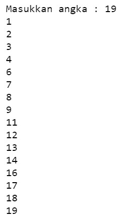

### NAMA : RIZQI ZAMZAMI JAMIL
### NIM     : 2131710089

## JOBSHEET 7

## PERULANGAN 1

### Tujuan

Mahasiswa mampu menyelesaikan permasalahan/studi kasus menggunakan sintaks perulangan 1 dan mengimplemantasikannya dalam bahasa pemrogaman java.

### Alat dan Bahan
+ PC/laptop
+ Browser(chrome, firefox, safari)
+ Koneksi internet

### Praktikum

#### Percobaan 1 : Penggunaan for, while dan do-while

#### Waktu percobaan : 40 menit

1. Perhatikan flowchart perulangan for dibawah ini!

    <p align="left">
    
    </p>
    

> Flowchart diatas digunakan untuk menghitung nilai faktorial, selanjutnya kita akan membuat programnya berdasarkan
> flowchart di atas!

2. Tambahkan library Scanner, deklarasi Scanner, dan buat variabel angka untuk menampung data yang diinput melalui keyboard


```Java
// Ketik kode program di bawah sini
import java.util.Scanner;
Scanner input = new Scanner(System.in);
int angka;
```

3. Buatlah deklarasi dan inisialisasi variabel faktorial sesuai dengan flowchart diatas


```Java
// Ketik kode program di bawah sini
int faktorial=1;
```

4. Tambahkan struktur perulangan untuk menghitung hasil faktorial sebuah nilai yang diinputkan menggunakan for
    
    <p align="left">
    
    </p>


```Java
// Ketik kode program di atas di bawah sini
System.out.println("====PROGRAM MENGHITUNG NILAI FAKTORIAL DENGAN FOR====");
System.out.println("Masukkan Bilangan : ");
angka = input.nextInt();
for(int i=1; i<=angka; i++)
    faktorial*=i;
System.out.print("Nilai faktorial bilangan tersebut adalah : "+ faktorial);
```

    ====PROGRAM MENGHITUNG NILAI FAKTORIAL DENGAN FOR====
    Masukkan Bilangan : 
    5
    Nilai faktorial bilangan tersebut adalah : 120

5. Ubah nilai variabel faktorial seperti semula. Kemudian gunakan struktur perulangan while untuk menghitung hasil faktorial sebuah nilai yang diinputkan
    
    <p align="left">
    
    </p>


```Java
// Ketik kode program di atas di bawah sini
faktorial=1;
System.out.println("====PROGRAM MENGHITUNG NILAI FAKTORIAL DENGAN WHILE====");
System.out.print("Masukkan Bilangan : ");
angka = input.nextInt();
int i=1;
while(i<=angka){
    faktorial*=i;
    i++;
}
System.out.print("Nilai faktorial bilangan tersebut adalah : "+ faktorial);
```

    ====PROGRAM MENGHITUNG NILAI FAKTORIAL DENGAN WHILE====
    Masukkan Bilangan : 5
    Nilai faktorial bilangan tersebut adalah : 120

6. Kembalikan lagi nilai variabel faktorial seperti semula. Gunakan struktur perulangan do-while untuk menghitung hasil faktorial sebuah nilai yang diinputkan
    
    <p align="left">
    
    </p>


```Java
// Ketik kode program di atas di bawah sini
faktorial=1;
System.out.println("====PROGRAM MENGHITUNG NILAI FAKTORIAL DENGAN DO-WHILE====");
System.out.print("Masukkan Bilangan : ");
angka = input.nextInt();
int i=1;
do
{
    faktorial*=i;
    i++;
}
while(i<=angka);
System.out.println("Nilai faktorial bilangan tersebut adalah : "+faktorial);
```

    ====PROGRAM MENGHITUNG NILAI FAKTORIAL DENGAN DO-WHILE====
    Masukkan Bilangan : 5
    Nilai faktorial bilangan tersebut adalah : 120
    

##### Pertanyaan
1. Pada program diatas, apakah kegunaan baris berikut?
<p align="left">
    
    </p>

#### Jawab
Menyimpan nilai variabel faktorial kemudian dikali dengan variabel i atau secara jelasnya menghitung nilai faktorial itu sendiri (i). 
faktorial = faktorial * i 

2. Modifikasi program diatas dibagian struktur pemilihannya sehingga hasilnya menjadi seperti di bawah ini:
<p align="left">
    
    </p>


```Java
// Ketik kode program di atas di bawah sini
// Jawaban nomor 2

faktorial = 1;
System.out.println("=====PROGRAM MENGHITUNG NILAI FAKTORIAL DENGAN FOR=====");
System.out.print("Masukan Bilangan : ");
angka = input.nextInt();
int i=1 ;
System.out.print(angka + "Faktorial = " );
for(i = 1;i <= angka  ; i++){
    faktorial *= i;
    if(i == angka){
        System.out.print(i);
    }else{
        System.out.print(i + "x");
    }
}
System.out.println(" = " + faktorial);
```

    =====PROGRAM MENGHITUNG NILAI FAKTORIAL DENGAN FOR=====
    Masukan Bilangan : 5
    5Faktorial = 1x2x3x4x5 = 120
    

#### Percobaan 2 : Keluar dari perulangan menggunakan break

#### Waktu percobaan : 40 menit

1. Buatlah perulangan dengan menggunakan for yang memanfaatkan keyword break
<p align="left">
    
    </p>


```Java
// Ketik kode program di atas di bawah sini
Scanner input=new Scanner(System.in);
int angka, total;
System.out.println("===PROGRAM FOR LOOP DENGAN BREAK===");
for(total=0;true;){
    System.out.print("Masukkan Bilangan : ");
    angka=input.nextInt();
    total+=angka;
        if(total>50) break;
}
System.out.println("Jumlah angka-angka yang telah dimasukkan : "+total);
```

    ===PROGRAM FOR LOOP DENGAN BREAK===
    Masukkan Bilangan : 1
    Masukkan Bilangan : 2
    Masukkan Bilangan : 3
    Masukkan Bilangan : 51
    Jumlah angka-angka yang telah dimasukkan : 57
    

2. Buat perulangan yang sama dengan struktur perulangan while
<p align="left">
    
    </p>


```Java
// Ketik kode program di atas di bawah sini
Scanner input=new Scanner(System.in);
int angka, total;
System.out.println("===PROGRAM WHILE LOOP DENGAN BREAK===");
total=0;
while(true){
    System.out.print("Masukkan Bilangan : ");
    angka=input.nextInt();
    total+=angka;
    if(total>50) break;
}
System.out.println("Jumlah angka-angka yang telah dimasukkan : "+total);
```

    ===PROGRAM WHILE LOOP DENGAN BREAK===
    Masukkan Bilangan : 1
    Masukkan Bilangan : 2
    Masukkan Bilangan : 3
    Masukkan Bilangan : 51
    Jumlah angka-angka yang telah dimasukkan : 57
    

3. Tuliskan perulangan diatas dalam struktur do-while
    <p align="left">
    
    </p>


```Java
// Ketik kode program di atas di bawah sini
int angka, total;
System.out.println("===PROGRAM DO-WHILE LOOP DENGAN BREAK===");
total=0;
do
{
    System.out.print("Masukkan Bilangan : ");
    angka=input.nextInt();
    total+=angka;
    if(total>50) break;
}
while(true);
System.out.println("Jumlah angka-angka yang telah dimasukkan : "+total);
```

    ===PROGRAM DO-WHILE LOOP DENGAN BREAK===
    Masukkan Bilangan : 1
    Masukkan Bilangan : 2
    Masukkan Bilangan : 3
    Masukkan Bilangan : 51
    Jumlah angka-angka yang telah dimasukkan : 57
    

##### Pertanyaan
1. Jelaskan fungsi kode program yang telah dibuat pada percobaan diatas!

#### Jawab
Program diatas digunakan untuk memasukkan bilanga-bilangan dengan maksimal bilangan 50, ketika terdapat bilangan yang lebih dari 50, maka program akan menjumlah bilangan-bilangan yang telah dimasukkan sampai bilangan terakhir yang lebih dari 50

2. Jelaskan fungsi kode berikut!
    <p align="left">
    
    </p>


#### Jawab
Fungsi kode tersebut adalah sebuah kondisi nilai variabel total dimulai dari nol, jika hasilnya true maka statement selanjutnya akan di jalankan.

#### Percobaan 3 : Keluar dari step perulangan menggunakan continue

#### Waktu percobaan : 40 menit

1. Buat program looping menggunakan struktur perulangan for seperti di bawah ini: 
<p align="left">
    
    </p>


```Java
// Ketik kode program di atas di bawah sini
Scanner input=new Scanner(System.in);
int angka, total, count;
double avg;
count=0;
System.out.println("===PROGRAM FOR LOOP DENGAN CONTINUE===");
for(int i=0;i<5;i++){
    System.out.print("Masukkkan Bilangan : ");
    angka=input.nextInt();
    if(angka>=50) continue;
    total+=angka;
    count++;
}
System.out.println("Jumlah angka-angka yang kurang dari 50: "+total);
avg=(double)total/count;
System.out.println("Rata-rata angka yang kurang dari 50: "+avg);
```

    ===PROGRAM FOR LOOP DENGAN CONTINUE===
    Masukkkan Bilangan : 1
    Masukkkan Bilangan : 2
    Masukkkan Bilangan : 3
    Masukkkan Bilangan : 51
    Masukkkan Bilangan : 52
    Jumlah angka-angka yang kurang dari 50: 6
    Rata-rata angka yang kurang dari 50: 2.0
    

5. Jalankan program. Amati apa yang terjadi!

Ketika program dijalankan, maka pengguna dapat memasukkan bilangan secara terus menerus dengan syarat apabila terdapat 2 bilangan diatas 50, maka program masukan akan berakhir dan dilanjut program akan menghitung dan menampilkan angka-angka yang kurang dari 50, kemudian program akan menghitung dan menampilkan rata-rata angka yang kurang dari 50.

##### Pertanyaan
1. Jelaskan Perbedaan dari percobaan 2 dan percobaan 3

#### Jawab
Perbedaannya adalah percobaan ke 2 menggunakan "break" yang digunakan untuk menghentikan paksa proses perulangan yang berlangsung. sedangkan percobaan 3 menggunakan "continue" yang digunakan untuk menghentikan perulangan yang saat ini terjadi (1 perulangan saja), kemudian melanjutkan perulangan berikutnya atau bisa disebut juga untuk melewati 1 perulangan. 

2. Jelaskan apa fungsi perintah kode program dibawah ini?
<p align="left">
    
    </p>

#### Jawab
-Fungsi program if(angka>=50) continue; adalah apabila kita memasukkan angka lebih besar sama dengan 50 maka program akan melewati perulangan, tetapi tetap melanjutkan ke tahap berikutnya. 

-Fungsi program total+=angka; adalah apabila kita memasukkan angka yang dimasukkan sesuai dengan syarat, maka akan terjadi perulangan. 

-Fungsi program count++ adalah untuk mencatat looping yang ditentukan.

### Tugas

#### Waktu pengerjaan Tugas: 140 menit

1. Buatlah program yang meminta masukan user sebuah bilangan bulat N (N > 0). Program kemudian menampilkan penjumlahan N bilangan genap positif pertama (bilangan genap ≥ 0).
Contoh: 
    •	Jika user memasukkan N = 10, program akan menghitung banyaknya jumlah bilangan positive di dalam range bilangan 1-10   kemudian menampilkan penjumlahan bilangan positive bilangan bilangan diantara 1-10 yaitu : 
        0 + 2 + 4 + 6 + 10 = 30. 
        Setelah itu program akan menampilkan rata-rata dari bilangan positive yang telah dijumlahkan tadi.
    •	Contoh output program dan flowchart
<br/><br/>
  

<br/>


```Java
// Ketik kode program disini
import java.util.Scanner;
Scanner input = new Scanner(System.in);
int bil, jmlBilGenap, totalGenap=0;
double avg;
System.out.println("====PROGRAM MENGHITUNG ANGKA GENAP====");
System.out.print("Masukkan Bilangan : ");
bil = input.nextInt();
System.out.println("=-=-=-=-=-=-=-=-=-=-=-=-=-=-=-=-=-=-=-=");

jmlBilGenap=bil/2;
System.out.println("Banyaknya bilangan genap dari 1 sampai "+ bil +" adalah "+jmlBilGenap);
System.out.print("Angka genap dalam range tersebut adalah ");

int i;
for(i=1;i<=bil;i++){
    if(i%2!=0) {
        continue; 
    }else{
        if(i == bil){
            System.out.print(i);
        }else{
            if(bil % 2 ==0){
                System.out.print(i + ", ");
            }else{
                System.out.print(i);
            }
        }
    }   totalGenap +=i;  
    
}
avg=totalGenap/jmlBilGenap;
System.out.println("\nHasil penjumlahan bilangan genap dari 1 sampai "+bil+" adalah "+totalGenap);
System.out.println("Rata-rata bilangan genap dari 1 sampai "+bil+" adalah "+avg);
```

    ====PROGRAM MENGHITUNG ANGKA GENAP====
    Masukkan Bilangan : 10
    =-=-=-=-=-=-=-=-=-=-=-=-=-=-=-=-=-=-=-=
    Banyaknya bilangan genap dari 1 sampai 10 adalah 5
    Angka genap dalam range tersebut adalah 2, 4, 6, 8, 10
    Hasil penjumlahan bilangan genap dari 1 sampai 10 adalah 30
    Rata-rata bilangan genap dari 1 sampai 10 adalah 6.0
    

2. Buatlah program untuk menampilkan angka 1 hingga angka masukan pengguna secara berurutan dan melompati angka kelipatan 5. Seperti tampilan di bawah ini
<p align="left">

</p>


```Java
// Ketik kode program disini
Scanner input=new Scanner(System.in);
int angka;
System.out.print("Masukkkan angka : ");
angka=input.nextInt();
System.out.println("=-=-=-=-=-=-=-=-=-=-=-=-=");

for(int i=1;i<=angka;i++){
    if(i%5==0) continue;
        System.out.println(i);
}
```

    Masukkkan angka : 19
    =-=-=-=-=-=-=-=-=-=-=-=-=
    1
    2
    3
    4
    6
    7
    8
    9
    11
    12
    13
    14
    16
    17
    18
    19
    

3. Buatlah sebuah program yang menampilkan deret bilangan fibonacci sebagai berikut. Dimana bilangan yang terletak di sebelah kanan adalah hasil penjumlahan dari 2 bilangan sebelumnya
 <p align="left">
    
    </p>


```Java
// Ketik kode program disini
import java.util.Scanner;
int a= 0 ,b= 1 ,c,i,count ;
Scanner scan = new Scanner(System.in);
System.out.print("Masukkan jumlah deret bilangan fibonacci: ");
count = scan.nextInt();

System.out.println("=-=-=-=-=-=-=-=-=-=-=-=-=-=-=-=-=-=-=-=");

for (i= 2 ;i<count;++i) //loop dimulai dari 2 karena 0 dan 1 sudah dicetak
{
c=a+b;
System.out.println( "Sum of: " +a+ "+" +b+ "=" +c);
a=b;
b=c;
}
```

    Masukkan jumlah deret bilangan fibonacci: 12
    =-=-=-=-=-=-=-=-=-=-=-=-=-=-=-=-=-=-=-=
    Sum of: 0+1=1
    Sum of: 1+1=2
    Sum of: 1+2=3
    Sum of: 2+3=5
    Sum of: 3+5=8
    Sum of: 5+8=13
    Sum of: 8+13=21
    Sum of: 13+21=34
    Sum of: 21+34=55
    Sum of: 34+55=89
    


```Java

```
