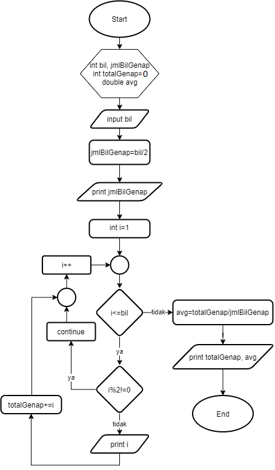

## JOBSHEET 7

## PERULANGAN 1

#### Nama = Fitrah Rahmadhani Ahmad
#### NIM = 2131710092
#### Kelas = MI-1E

### Tujuan

Mahasiswa mampu menyelesaikan permasalahan/studi kasus menggunakan sintaks perulangan 1 dan mengimplemantasikannya dalam bahasa pemrogaman java.

### Alat dan Bahan
+ PC/laptop
+ Browser(chrome, firefox, safari)
+ Koneksi internet

### Praktikum

#### Percobaan 1 : Penggunaan for, while dan do-while

#### Waktu percobaan : 40 menit

1. Perhatikan flowchart perulangan for dibawah ini!

    <p align="left">
    
    </p>
    

> Flowchart diatas digunakan untuk menghitung nilai faktorial, selanjutnya kita akan membuat programnya berdasarkan
> flowchart di atas!

2. Tambahkan library Scanner, deklarasi Scanner, dan buat variabel angka untuk menampung data yang diinput melalui keyboard


```Java
import java.util.Scanner;

//Deklarasi Scanner dan Variabel
Scanner input = new Scanner(System.in);
int angka, faktorial = 1;

//Input data
System.out.print("Masukkan bilangan: ");
angka = input.nextInt();
```

    Masukkan bilangan: 5
    

3. Buatlah deklarasi dan inisialisasi variabel faktorial sesuai dengan flowchart diatas


```Java
import java.util.Scanner;

//Deklarasi Scanner dan Variabel
Scanner input = new Scanner(System.in);
int angka, faktorial = 1;

//Input data
System.out.print("Masukkan bilangan: ");
angka = input.nextInt();

//Inisialisasi
int i = 1;
```

    Masukkan bilangan: 5
    

4. Tambahkan struktur perulangan untuk menghitung hasil faktorial sebuah nilai yang diinputkan menggunakan for
    
    <p align="left">
    
    </p>


```Java
import java.util.Scanner;

//Deklarasi Scanner dan Variabel
Scanner input = new Scanner(System.in);
int angka, faktorial = 1;

//Input data
System.out.println("=====PROGRAM MENGHITUNG NILAI FAKTORIAL DENGAN FOR=====");
System.out.print("Masukkan bilangan: ");
angka = input.nextInt();

//For looping
for (int i=1; i<=angka; i++)
    faktorial*=i;

//Output
System.out.println("Nilai faktorial bilangan tersebut adalah: " + faktorial);
```

    =====PROGRAM MENGHITUNG NILAI FAKTORIAL DENGAN FOR=====
    Masukkan bilangan: 5
    Nilai faktorial bilangan tersebut adalah: 120
    

5. Ubah nilai variabel faktorial seperti semula. Kemudian gunakan struktur perulangan while untuk menghitung hasil faktorial sebuah nilai yang diinputkan
    
    <p align="left">
    
    </p>


```Java
import java.util.Scanner;

//Deklarasi Scanner dan Variabel
Scanner input = new Scanner(System.in);
int angka, faktorial = 1;

//Input data
System.out.println("=====PROGRAM MENGHITUNG NILAI FAKTORIAL DENGAN WHILE=====");
System.out.print("Masukkan bilangan: ");
angka = input.nextInt();

//Inisialisasi
int i = 1;

//While looping
while (i<=angka){
    faktorial*=i;
    i++;
}

//Output
System.out.println("Nilai faktorial bilangan tersebut adalah: " + faktorial);
```

    =====PROGRAM MENGHITUNG NILAI FAKTORIAL DENGAN WHILE=====
    Masukkan bilangan: 5
    Nilai faktorial bilangan tersebut adalah: 120
    

6. Kembalikan lagi nilai variabel faktorial seperti semula. Gunakan struktur perulangan do-while untuk menghitung hasil faktorial sebuah nilai yang diinputkan
    
    <p align="left">
    
    </p>


```Java
import java.util.Scanner;

//Deklarasi Scanner dan Variabel
Scanner input = new Scanner(System.in);
int angka, faktorial = 1;

//Input data
System.out.println("=====PROGRAM MENGHITUNG NILAI FAKTORIAL DENGAN DO-WHILE=====");
System.out.print("Masukkan bilangan: ");
angka = input.nextInt();

//Inisialisasi
int i = 1;

//Do-while looping
do {
    faktorial*=i;
    i++;
}
while (i<=angka);

//Output
System.out.println("Nilai faktorial bilangan tersebut adalah: " + faktorial);
```

    =====PROGRAM MENGHITUNG NILAI FAKTORIAL DENGAN DO-WHILE=====
    Masukkan bilangan: 5
    Nilai faktorial bilangan tersebut adalah: 120
    

##### Pertanyaan
1. Pada program diatas, apakah kegunaan baris berikut?
<p align="left">
    
    </p>

Faktorial*=i merupakan operator assignment yang berguna untuk memberikan nilai dalam variabel. Bentuk lain dari baris tersebut adalah "faktorial = faktorial * i. Secara khusus "faktorial*=i berguna sebagai operasi perkalian yang mana akan dilakukan terus sampai syarat tidak terpenuhi, yaitu i <= angka.

2. Modifikasi program diatas dibagian struktur pemilihannya sehingga hasilnya menjadi seperti di bawah ini:
<p align="left">
    
    </p>


```Java
import java.util.Scanner;

//Deklarasi Scanner dan Variabel
Scanner input = new Scanner(System.in);
int angka, faktorial = 1, status;

//Input data
System.out.println("=====PROGRAM MENGHITUNG NILAI FAKTORIAL DENGAN WHILE=====");
System.out.print("Masukkan bilangan: ");
angka = input.nextInt();
System.out.print(angka + " Faktorial = ");

//Inisialisasi
int i;
//For looping
for (int i=1; i<=angka; i++){
    faktorial *= i;
    System.out.print(i);
    if(i == angka) continue;
    System.out.print("x");
    
}

System.out.print(" = " + faktorial);
```

    =====PROGRAM MENGHITUNG NILAI FAKTORIAL DENGAN WHILE=====
    Masukkan bilangan: 5
    5 Faktorial = 1x2x3x4x5 = 120

#### Percobaan 2 : Keluar dari perulangan menggunakan break

#### Waktu percobaan : 40 menit

1. Buatlah perulangan dengan menggunakan for yang memanfaatkan keyword break
<p align="left">
    
    </p>


```Java
import java.util.Scanner;

//Deklarasi Scanner dan Variabel
Scanner input = new Scanner(System.in);
int angka, total;

//Input + for looping + break
System.out.println("=====PROGRAM FOR LOOP DENGAN BREAK=====");
for (total=0; true;){
    System.out.print("Masukkan bilangan: ");
    angka = input.nextInt();
    total+=angka;
    if(total > 50) break;
}

//Output
System.out.println("Jumlah angka-angka yang telah dimasukkan : " + total);
```

    =====PROGRAM FOR LOOP DENGAN BREAK=====
    Masukkan bilangan: 1
    Masukkan bilangan: 5
    Masukkan bilangan: 10
    Masukkan bilangan: 25
    Masukkan bilangan: 10
    Jumlah angka-angka yang telah dimasukkan : 51
    

2. Buat perulangan yang sama dengan struktur perulangan while
<p align="left">
    
    </p>


```Java
import java.util.Scanner;

//Deklarasi Scanner dan Variabel
Scanner input = new Scanner(System.in);
int angka, total;

//Inisialisasi
total = 0;

//Input + while looping + break
System.out.println("=====PROGRAM WHILE LOOP DENGAN BREAK=====");
while (true){
    System.out.print("Masukkan bilangan: ");
    angka = input.nextInt();
    total+=angka;
    if(total > 50) break;
}

//Output
System.out.println("Jumlah angka-angka yang telah dimasukkan : " + total);
```

    =====PROGRAM WHILE LOOP DENGAN BREAK=====
    Masukkan bilangan: 1
    Masukkan bilangan: 5
    Masukkan bilangan: 15
    Masukkan bilangan: 66
    Jumlah angka-angka yang telah dimasukkan : 87
    

3. Tuliskan perulangan diatas dalam struktur do-while
    <p align="left">
    
    </p>


```Java
import java.util.Scanner;

//Deklarasi Scanner dan Variabel
Scanner input = new Scanner(System.in);
int angka, total;

//Inisialisasi
total = 0;

//Input + do-while looping + break
System.out.println("=====PROGRAM WHILE LOOP DENGAN BREAK=====");
do {
    System.out.print("Masukkan bilangan: ");
    angka = input.nextInt();
    total+=angka;
    if(total > 50) break;
}
while (true);

//Output
System.out.println("Jumlah angka-angka yang telah dimasukkan : " + total);
```

    =====PROGRAM WHILE LOOP DENGAN BREAK=====
    Masukkan bilangan: 10
    Masukkan bilangan: 20
    Masukkan bilangan: 30
    Jumlah angka-angka yang telah dimasukkan : 60
    

##### Pertanyaan
1. Jelaskan fungsi kode program yang telah dibuat pada percobaan diatas!

Secara umum terdapat 3 jenis looping yang berbeda yaitu for loop, while loop, dan do-while loop. Ketiganya memiliki kesamaan yaitu penggunaan kode program break. Kode program if(total > 50) break; berguna sebagai penyeleksi / penghenti sebuah looping jika memenuhi syarat yang ada di dalam ekspresi if .

2. Jelaskan fungsi kode berikut!
    <p align="left">
    
    </p>


Untuk menganalisis fungsi kode for "(total=0;true;){", kita pecah dulu tiap eksresinya. Ekspresi pertama "total=0" merupakan sebuah inisialisasi variabel yang artinya variabel total memiliki nilai awal 0 yang selanjutnya nilai tersebut akan berubah sesuai operasi looping. Ekspresi kedua "true" berjenis boolean, ini  pasangan dari break sebagai penyeleksi. Secara sederhana perulangan akan terus dilakukan sampai memenuhi syarat "true" dari if statement.


#### Percobaan 3 : Keluar dari step perulangan menggunakan continue

#### Waktu percobaan : 40 menit

1. Buat program looping menggunakan struktur perulangan for seperti di bawah ini: 
<p align="left">
    
    </p>


```Java
import java.util.Scanner;

//Deklarasi Scanner dan Variabel
Scanner input = new Scanner(System.in);
int angka, total, count;
double avg;

//Inisialisasi
count = 0;

//Input + For looping + continue
System.out.println("=====PROGRAM FOR LOOP DENGAN CONTINUE=====");
for (int i=0; i<5; i++){
    System.out.print("Masukkan bilangan : ");
    angka = input.nextInt();
    if(angka >= 50) continue;
    total+=angka;
    count++;
}
    
//Output
System.out.println("Jumlah angka-angka yang kurang dari 50 : " + total);
avg = (double) total / count;
System.out.println("Rata-rata angka yang kurang dari 50 : " + avg);
```

    =====PROGRAM FOR LOOP DENGAN CONTINUE=====
    Masukkan bilangan : 10
    Masukkan bilangan : 10
    Masukkan bilangan : 10
    Masukkan bilangan : 10
    Masukkan bilangan : 60
    Jumlah angka-angka yang kurang dari 50 : 40
    Rata-rata angka yang kurang dari 50 : 10.0
    

5. Jalankan program. Amati apa yang terjadi!

##### Pertanyaan
1. Jelaskan Perbedaan dari percobaan 2 dan percobaan 3

Setidaknya terdapat tiga perbedaan mendasar yang dapat kita amati dari kedua percobaan tersebut.

Perbedaan pertama : percobaan 2 menggunakan break, sedangkan percobaan 3 menggunakan continue

Perbedaan kedua : percobaan 2 memberikan kebebasan pada kita untuk memasukkan berkali-kali input selama jumlah dari keseluruhan nilai tidak melebihi 50. Sedangkan percobaan 3 memberikan kesempatan input sebanyak 5 kali saja.

Perbedaan ketiga : percobaan 2 merupakan operasi penjumlahan yang akan berhenti jika total nilai lebih dari 50. Sedangkan percobaan 3 merupakan operasi aritmatika dengan karakteristik akan melakukan penjumlahan dan rata-rata dari semua bilangan jika hanya nilainya kurang dari 50.

2. Jelaskan apa fungsi perintah kode program dibawah ini?
<p align="left">
    
    </p>

Secara sederhana, perintah tersebut berarti jika angka yang dimasukkan lebih dari 50 maka akan langsung dilewati dalam artian tidak akan dieksekusi di baris selanjutnya ("total+=angka;" dan "count++;")

### Tugas

#### Waktu pengerjaan Tugas: 140 menit

1. Buatlah program yang meminta masukan user sebuah bilangan bulat N (N > 0). Program kemudian menampilkan penjumlahan N bilangan genap positif pertama (bilangan genap ≥ 0).
Contoh: 
    •	Jika user memasukkan N = 10, program akan menghitung banyaknya jumlah bilangan positive di dalam range bilangan 1-10   kemudian menampilkan penjumlahan bilangan positive bilangan bilangan diantara 1-10 yaitu : 
        0 + 2 + 4 + 6 + 10 = 30. 
        Setelah itu program akan menampilkan rata-rata dari bilangan positive yang telah dijumlahkan tadi.
    •	Contoh output program dan flowchart
<br/><br/>
  

<br/>


```Java
import java.util.Scanner;

//Deklarasi Scanner dan Variabel
Scanner input = new Scanner(System.in);
int bil, jumBilGenap, totalGenap = 0;
double avg;

//Input 
System.out.print("Masukkan bilangan : ");
bil = input.nextInt();

//Aritmatika + Output1
jumBilGenap = bil / 2;
System.out.println("Jumlah bilangan genap dari 1 sampai " + bil + " adalah " + jumBilGenap);
System.out.print("Angka genap dalam range tersebut adalah ");


for (int i=1; i<= bil; i++){
    if(i %2 == 1) continue;
    System.out.print(i);
    totalGenap += i;
    if(i == bil) continue;
    System.out.print(",");
}  

    
//Output
    
avg = (double) totalGenap / jumBilGenap;
System.out.println("\nHasil penjumlahan bilangan genap 1 sampai " + bil + " adalah " + totalGenap);
System.out.println("Rata-rata bilangan genap 1 sampai " + bil + " adalah " + avg);
```

    Masukkan bilangan : 10
    Jumlah bilangan genap dari 1 sampai 10 adalah 5
    Angka genap dalam range tersebut adalah 2,4,6,8,10
    Hasil penjumlahan bilangan genap 1 sampai 10 adalah 30
    Rata-rata bilangan genap 1 sampai 10 adalah 6.0
    

2. Buatlah program untuk menampilkan angka 1 hingga angka masukan pengguna secara berurutan dan melompati angka kelipatan 5. Seperti tampilan di bawah ini
<p align="left">

</p>


```Java
import java.util.Scanner;

//Deklarasi Scanner dan Variabel
Scanner input = new Scanner(System.in);
int angka, nilai;

//Input
System.out.println("=====PROGRAM WHILE LOOP MENGHILANGKAN ANGKA KELIPATAN 5=====");
System.out.print("Masukkan nilai batas: ");
angka = input.nextInt();

//Inisialisasi
nilai = 0;
//While looping + Continue
while (nilai < angka){
    nilai = nilai + 1;
    if (nilai %5 == 0) continue;
    System.out.println(nilai);
}
```

    =====PROGRAM WHILE LOOP MENGHILANGKAN ANGKA KELIPATAN 5=====
    Masukkan nilai batas: 20
    1
    2
    3
    4
    6
    7
    8
    9
    11
    12
    13
    14
    16
    17
    18
    19
    

3. Buatlah sebuah program yang menampilkan deret bilangan fibonacci sebagai berikut. Dimana bilangan yang terletak di sebelah kanan adalah hasil penjumlahan dari 2 bilangan sebelumnya
 <p align="left">
    
    </p>


```Java
import java.util.Scanner;

//Deklarasi Scanner dan Variabel
Scanner input = new Scanner(System.in);
int nilai, nilai1, nilai2, batas;

//Input
System.out.println("===DERET FIBONACCI===");
System.out.print("Hasil deret bilangan Fibonacci ke: ");
batas = input.nextInt();

//Inisialisasi
nilai = 1;
nilai1 = 1;
nilai2 = 0;

//for looping
for(int i = 0; i<=batas; i++){
    System.out.print("Sum of: " + nilai2 + " + " + nilai1);
    nilai = nilai1 + nilai2;
    nilai2 = nilai1;
    nilai1 = nilai;
    System.out.println(" = " + nilai);
}
```

    ===DERET FIBONACCI===
    Hasil deret bilangan Fibonacci ke: 10
    Sum of: 0 + 1 = 1
    Sum of: 1 + 1 = 2
    Sum of: 1 + 2 = 3
    Sum of: 2 + 3 = 5
    Sum of: 3 + 5 = 8
    Sum of: 5 + 8 = 13
    Sum of: 8 + 13 = 21
    Sum of: 13 + 21 = 34
    Sum of: 21 + 34 = 55
    Sum of: 34 + 55 = 89
    Sum of: 55 + 89 = 144
    


```Java

```
