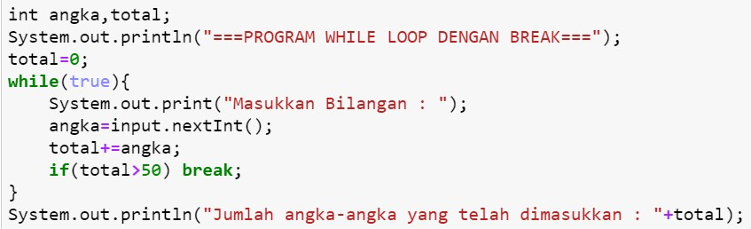

## JOBSHEET 7

## PERULANGAN 1

### Tujuan

Mahasiswa mampu menyelesaikan permasalahan/studi kasus menggunakan sintaks perulangan 1 dan mengimplemantasikannya dalam bahasa pemrogaman java.

### Alat dan Bahan
+ PC/laptop
+ Browser(chrome, firefox, safari)
+ Koneksi internet

### Praktikum

#### Percobaan 1 : Penggunaan for, while dan do-while

#### Waktu percobaan : 40 menit

1. Perhatikan flowchart perulangan for dibawah ini!

    <p align="left">
    
    </p>
    

> Flowchart diatas digunakan untuk menghitung nilai faktorial, selanjutnya kita akan membuat programnya berdasarkan
> flowchart di atas!

2. Tambahkan library Scanner, deklarasi Scanner, dan buat variabel angka untuk menampung data yang diinput melalui keyboard


```Java
import java.util.Scanner;
Scanner input = new Scanner(System.in);

```

3. Buatlah deklarasi dan inisialisasi variabel faktorial sesuai dengan flowchart diatas


```Java
int angka, faktorial=1;

```

4. Tambahkan struktur perulangan untuk menghitung hasil faktorial sebuah nilai yang diinputkan menggunakan for
    
    <p align="left">
    
    </p>


```Java
System.out.println("=====PROGRAM MENGHITUNG NILAI FAKTORIAL DENGAN FOR=====");
System.out.print("Masukkan Bilangan  : ");
angka = input.nextInt();
for(int i=1; i<=angka; i++)
    faktorial *= i;
System.out.print("Nilai faktorial bilangan tersebut adalah  : " + faktorial);

```

    =====PROGRAM MENGHITUNG NILAI FAKTORIAL DENGAN FOR=====
    Masukkan Bilangan  : 5
    Nilai faktorial bilangan tersebut adalah  : 120

5. Ubah nilai variabel faktorial seperti semula. Kemudian gunakan struktur perulangan while untuk menghitung hasil faktorial sebuah nilai yang diinputkan
    
    <p align="left">
    
    </p>


```Java
faktorial = 1;
System.out.println("=====PROGRAM MENGHITUNG NILAI FAKTORIAL DENGAN WHILE=====");
System.out.print("Masukkan Bilangan  : ");
angka = input.nextInt();
int i=1;
while(i<=angka){
    faktorial*=i;
    i++;
}
System.out.print("Nilai faktorial bilangan tersebut adalah  : " + faktorial);
```

    =====PROGRAM MENGHITUNG NILAI FAKTORIAL DENGAN WHILE=====
    Masukkan Bilangan  ; 5
    Nilai faktorial bilangan tersebut adalah  : 120

6. Kembalikan lagi nilai variabel faktorial seperti semula. Gunakan struktur perulangan do-while untuk menghitung hasil faktorial sebuah nilai yang diinputkan
    
    <p align="left">
    
    </p>


```Java
faktorial = 1;
System.out.println("=====PROGRAM MENGHITUNG NILAI FAKTORIAL DENGAN DO-WHILE=====");
System.out.print("Masukkan Bilangan  : ");
angka = input.nextInt();
int i = 1;
do{
    faktorial *= i;
    i++;
}
while(i<=angka);
System.out.print("Nilai faktorial bilangan tersebut adalan  : " + faktorial);
```

    =====PROGRAM MENGHITUNG NILAI FAKTORIAL DENGAN DO-WHILE=====
    Masukkan Bilangan  : 5
    Nilai faktorial bilangan tersebut adalan  : 120

##### Pertanyaan
1. Pada program diatas, apakah kegunaan baris berikut?
<p align="left">
    
    </p>

###### Jawab :
*= merupakan operator assignment adalah operator untuk memasukkan suatu nilai ke dalam variabel. Jadi kegunaan dari faktorial *= i; yaitu memberikan perintah kalikan isi variabel faktorial dengan i dan tampilkan hasilya

2. Modifikasi program diatas dibagian struktur pemilihannya sehingga hasilnya menjadi seperti di bawah ini:
<p align="left">
    
    </p>


```Java
import java.util.Scanner;
Scanner input = new Scanner(System.in);
int angka, faktorial=1;
faktorial = 1;
System.out.println("=====PROGRAM MENGHITUNG NILAI FAKTORIAL DENGAN FOR=====");
System.out.print("Masukan Bilangan : ");
angka = input.nextInt();
int i =1 ;
System.out.print(angka + " Faktorial = " );
for(i = 1;i <= angka  ; i++){
    faktorial *= i;
    if(i == angka){
        System.out.print(i);
    }else{
        System.out.print(i + "x");
    }
}
System.out.println(" = " + faktorial);
```

    =====PROGRAM MENGHITUNG NILAI FAKTORIAL DENGAN FOR=====
    Masukan Bilangan : 5
    5 Faktorial = 1x2x3x4x5 = 120
    

#### Percobaan 2 : Keluar dari perulangan menggunakan break

#### Waktu percobaan : 40 menit

1. Buatlah perulangan dengan menggunakan for yang memanfaatkan keyword break
<p align="left">
    
    </p>


```Java
// Ketik kode program di atas di bawah sini
Scanner input = new Scanner(System.in);
int angka, total;
System.out.println("===PROGRAM FOR LOOP DENGAN BREAK===");
for(total=0;true;){
    System.out.print("Masukkan Bilangan  : ");
    angka = input.nextInt();
    total += angka;
    if(total>50) break;
}
System.out.print("Jumlah angka-angka yang telah dimasukkan : " + total);
```

    ===PROGRAM FOR LOOP DENGAN BREAK===
    Masukkan Bilangan  : 12
    Masukkan Bilangan  : 11
    Masukkan Bilangan  : 4
    Masukkan Bilangan  : 31
    Jumlah angka-angka yang telah dimasukkan : 58

##### 2. Buat perulangan yang sama dengan struktur perulangan while
<p align="left">
    
    </p>


```Java
// Ketik kode program di atas di bawah sini
int angka, total;
System.out.println("===PROGRAM WHILE LOOP DENGAN BREAK===");
total = 0;
while(true){
    System.out.print("Masukkan Bilangan : ");
    angka = input.nextInt();
    total += angka;
    if (total>50) break;
}
System.out.println("Jumlah angka-angka yang telah dimasukkan : " + total);
```

    ===PROGRAM WHILE LOOP DENGAN BREAK===
    Masukkan Bilangan : 12
    Masukkan Bilangan : 11
    Masukkan Bilangan : 17
    Masukkan Bilangan : 21
    Jumlah angka-angka yang telah dimasukkan : 61
    

3. Tuliskan perulangan diatas dalam struktur do-while
    <p align="left">
    
    </p>


```Java
// Ketik kode program di atas di bawah sini
int angka, total;
System.out.println("===PROGRAM DO-WHILE LOOP DENGAN BREAK===");
total = 0;
do
{
    System.out.print("Masukkan Bilangan : ");
    angka = input.nextInt();
    total += angka;
    if(total>50) break;
}
while(true);
System.out.println("Jumlah angka-angka yang telah dimasukkan : " + total);
```

    ===PROGRAM DO-WHILE LOOP DENGAN BREAK===
    Masukkan Bilangan : 12
    Masukkan Bilangan : 11
    Masukkan Bilangan : 9
    Masukkan Bilangan : 3
    Masukkan Bilangan : 16
    Jumlah angka-angka yang telah dimasukkan : 51
    

##### Pertanyaan
1. Jelaskan fungsi kode program yang telah dibuat pada percobaan diatas!

#### Jawab :
fungsi kode program di atas memerintahkan untuk menginputkan angka dan menampilkan output dari ppenjumlahan angka yang diinputkan. inputan angka bertipe data integer. Perintah for berarti memerintahkan untuk menginput angka dan menjumlahkanbilangan yang sudah diinputkan, if jumlah sudah mencapai 50 maka sistem akan berhenti karena terdapat perintah break. Begitu juga dengan perintah while yang berarti apabila angka yang diinputkan bernilai true atau syarat terpenuhi terlebih dahulu maka sistem akan terus melakukan perulangan hingga perintah break yaitu sistem berhenti apabila jumlah mencapi 50. Fungsi kode program do-while pada prinsipnya sama dengan perintah while, perintah 
do while akan mengulangi statmen miliknya selama syarat perulangan terpenuhi, hanya saja perintah do-while akan 
menjalankan minimal 1 statemen dulu sebelum memeriksa syaratnya.


2. Jelaskan fungsi kode berikut!
    <p align="left">
    
    </p>


#### Jawab :

fungsi kode tersebut adalah untuk melakukan perulangan dengan nilai variabel total bernilai 0 dan memenuhi kondisi true 

#### Percobaan 3 : Keluar dari step perulangan menggunakan continue

#### Waktu percobaan : 40 menit

1. Buat program looping menggunakan struktur perulangan for seperti di bawah ini: 
<p align="left">
    
    </p>


```Java
// Ketik kode program di atas di bawah sini
Scanner input = new Scanner(System.in);
int angka, total, count;
double avg;
count = 0;
System.out.println("===PROGRAM FOR LOOP DENGAN CONTINUE===");
for(int i=0 ; i<5 ; i++){
    System.out.print("Masukkan Bilangan : ");
    angka = input.nextInt();
    if(angka>=50) continue;
    total += angka;
    count++;
}
System.out.println("Jumlah angka-angka yang kurang dari 50 : " + total);
avg = (double)total/count;
System.out.println("Rata-rata angka yang kurang dari 50    : " + avg);
```

    ===PROGRAM FOR LOOP DENGAN CONTINUE===
    Masukkan Bilangan : 55
    Masukkan Bilangan : 20
    Masukkan Bilangan : 20
    Masukkan Bilangan : 10
    Masukkan Bilangan : 10
    Jumlah angka-angka yang kurang dari 50 : 60
    Rata-rata angka yang kurang dari 50    : 15.0
    


```Java
5. Jalankan program. Amati apa yang terjadi!
```

##### Pertanyaan
1. Jelaskan Perbedaan dari percobaan 2 dan percobaan 3

#### Jawab :

Perbedannya pada percobaan 2 menggunakan break yang apabila tidak sesuai syarat akan langsung keluar dari loop sedangkan penggunaan continue berarti melewati satu loop dan akan dilanjutkan lagi selagi syarat terpenuhi

2. Jelaskan apa fungsi perintah kode program dibawah ini?
<p align="left">
    
    </p>

#### Jawab :

fungsi nya jika angka yang diinputkan lebih dari sama dengan 50 maka akan dilompati atau keluar dari loop sementara, 
dan akan dilanjutkan loop berikutnya. Total yang ditampilkan sudah ditambahkan dengan angka yang diinput dan count
merupakan perhitungan jumlah data dalam daftar

### Tugas

#### Waktu pengerjaan Tugas: 140 menit

1. Buatlah program yang meminta masukan user sebuah bilangan bulat N (N > 0). Program kemudian menampilkan penjumlahan N bilangan genap positif pertama (bilangan genap ≥ 0).
Contoh: 
    •	Jika user memasukkan N = 10, program akan menghitung banyaknya jumlah bilangan positive di dalam range bilangan 1-10   kemudian menampilkan penjumlahan bilangan positive bilangan bilangan diantara 1-10 yaitu : 
        0 + 2 + 4 + 6 + 10 = 30. 
        Setelah itu program akan menampilkan rata-rata dari bilangan positive yang telah dijumlahkan tadi.
    •	Contoh output program dan flowchart
<br/><br/>
  

<br/>


```Java
// Ketik kode program disini
import java.util.Scanner;
Scanner input = new Scanner(System.in);
int i, bil, jumBilGenap;
int totalGenap = 0;
double avg;

System.out.print("Masukkan angka : ");
bil = input.nextInt();
jumBilGenap = bil/2;
System.out.println("Banyaknya bilangan genap 1 sampai dengan "+bil+" adalah "+jumBilGenap);
System.out.print("Angka genap dalam range tersebut adalah ");

do{
    i++;
    if(i%2==0){
        totalGenap += i;
        if(i == bil){;
        System.out.print(i);    
        }else{
        System.out.print(i + ",");
        }
    }else{
        continue;
    }

}
while(i < bil);
avg = (double) totalGenap /jumBilGenap;
System.out.println("");
System.out.println("Hasil penjumlahan bilangan genap dari 1 sampai "+bil+" adalah "+totalGenap);
System.out.println("Rata-rata bilangan genap dari 1 sampai "+bil+" adalah "+avg);

```

    Masukkan angka : 10
    Banyaknya bilangan genap 1 sampai dengan 10 adalah 5
    Angka genap dalam range tersebut adalah 2,4,6,8,10
    Hasil penjumlahan bilangan genap dari 1 sampai 10 adalah 30
    Rata-rata bilangan genap dari 1 sampai 10 adalah 6.0
    

2. Buatlah program untuk menampilkan angka 1 hingga angka masukan pengguna secara berurutan dan melompati angka kelipatan 5. Seperti tampilan di bawah ini
<p align="left">

</p>


```Java
// Ketik kode program disini
import java.util.Scanner;
Scanner input = new Scanner(System.in);
int angka, i;
System.out.print("Masukkan Angka: ");
    angka = input.nextInt();
i = 1;
do{
   if(i%5==0)continue; 
    System.out.println(i);
} 
while(i++ <= angka);

```

    Masukkan Angka: 19
    1
    2
    3
    4
    6
    7
    8
    9
    11
    12
    13
    14
    16
    17
    18
    19
    

3. Buatlah sebuah program yang menampilkan deret bilangan fibonacci sebagai berikut. Dimana bilangan yang terletak di sebelah kanan adalah hasil penjumlahan dari 2 bilangan sebelumnya
 <p align="left">
    
    </p>


##### // Ketik kode program disini


```Java
Scanner input = new Scanner(System.in);
int a1, a2, a3, angka;
System.out.print("Masukkan jumlah deret Fibonacci: ");
angka = input.nextInt();

for(a1 = 2;a1 < angka;a1++){
    a3 = a1 + a2;
    System.out.println("Sum of : " +a1+ "+" +a2+ "=" +a3);
    a1 = a2;
    a2 = a3;
    if(a3 == angka)break;
}
```

    Masukkan jumlah deret Fibonacci: 89
    Sum of : 2+0=2
    Sum of : 1+2=3
    Sum of : 3+3=6
    Sum of : 4+6=10
    Sum of : 7+10=17
    Sum of : 11+17=28
    Sum of : 18+28=46
    Sum of : 29+46=75
    Sum of : 47+75=122
    Sum of : 76+122=198
    


```Java

```
