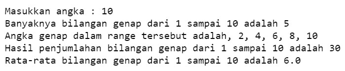

## JOBSHEET 7

## PERULANGAN 1

### Tujuan

Mahasiswa mampu menyelesaikan permasalahan/studi kasus menggunakan sintaks perulangan 1 dan mengimplemantasikannya dalam bahasa pemrogaman java.

### Alat dan Bahan
+ PC/laptop
+ Browser(chrome, firefox, safari)
+ Koneksi internet

### Praktikum

#### Percobaan 1 : Penggunaan for, while dan do-while

#### Waktu percobaan : 40 menit

1. Perhatikan flowchart perulangan for dibawah ini!

    <p align="left">
    
    </p>
    

> Flowchart diatas digunakan untuk menghitung nilai faktorial, selanjutnya kita akan membuat programnya berdasarkan
> flowchart di atas!

2. Tambahkan library Scanner, deklarasi Scanner, dan buat variabel angka untuk menampung data yang diinput melalui keyboard


```Java
// Ketik kode program di bawah sini
import java.util.Scanner;
Scanner input = new Scanner(System.in);
```


```Java
3. Buatlah deklarasi dan inisialisasi variabel faktorial sesuai dengan flowchart diatas
```


```Java
// Ketik kode program di bawah sini
int angka , faktorial = 1;
```

4. Tambahkan struktur perulangan untuk menghitung hasil faktorial sebuah nilai yang diinputkan menggunakan for
    
    <p align="left">
    
    </p>


```Java
// Ketik kode program di atas di bawah sini
System.out.println("=====PROGRAM MENGHITUNG NILAI FAKTORIAL DENGAN FOR=====");
System.out.print("Masukan Bilangan : ");
angka = input.nextInt();
for(int i=1;i <= angka ; i++){
    faktorial *= i;
}
System.out.println("Nilai faktorial bilangan tersebut adalah : " + faktorial);
```

    =====PROGRAM MENGHITUNG NILAI FAKTORIAL DENGAN FOR=====
    Masukan Bilangan : 2
    Nilai faktorial bilangan tersebut adalah : 2
    

5. Ubah nilai variabel faktorial seperti semula. Kemudian gunakan struktur perulangan while untuk menghitung hasil faktorial sebuah nilai yang diinputkan
    
    <p align="left">
    
    </p>


```Java
// Ketik kode program di atas di bawah sini
faktorial = 1;
System.out.println("=====PROGRAM MENGHITUNG NILAI FAKTORIAL DENGAN FOR=====");
System.out.print("Masukan Bilangan : ");
angka = input.nextInt();
int i=1;
while(i <= angka){
    faktorial *= i;
    i++;
}
System.out.println("Nilai faktorial bilangan tersebut adalah : " + faktorial);
```

    =====PROGRAM MENGHITUNG NILAI FAKTORIAL DENGAN FOR=====
    Masukan Bilangan : 8
    Nilai faktorial bilangan tersebut adalah : 40320
    

6. Kembalikan lagi nilai variabel faktorial seperti semula. Gunakan struktur perulangan do-while untuk menghitung hasil faktorial sebuah nilai yang diinputkan
    
    <p align="left">
    
    </p>


```Java
import java.util.Scanner;
Scanner input = new Scanner(System.in);
int angka , faktorial = 1;
System.out.println("=====PROGRAM MENGHITUNG NILAI FAKTORIAL DENGAN FOR=====");
System.out.print("Masukan Bilangan : ");
angka = input.nextInt();
int i=1;
do{
    faktorial *= i;
    i++;
}
while(i <= angka);
System.out.println("Nilai faktorial bilangan tersebut adalah : " + faktorial);
```

    =====PROGRAM MENGHITUNG NILAI FAKTORIAL DENGAN FOR=====
    Masukan Bilangan : 5
    Nilai faktorial bilangan tersebut adalah : 120
    

##### Pertanyaan
1. Pada program diatas, apakah kegunaan baris berikut?
<p align="left">
    
    </p>
    
   
##### Jawaban
1. berfungsi agar hasil di outpunya bilangan yang kita masukkan tadi menjadi suatu perkalian berurut pada bilangan yang kita masukkan tadi. Contoh kita memasukkan bilangan 5 , berarti jika menggunakan program tersebut dapat dieksekusi menjadi suatu perkalian berurut hingga bilngan yang kita masukkan tadi. 5! = 1x2x3x4x5

2. Modifikasi program diatas dibagian struktur pemilihannya sehingga hasilnya menjadi seperti di bawah ini:
<p align="left">
    
    </p>


```Java
// Ketik kode program di atas di bawah sini
faktorial = 1;
System.out.println("=====PROGRAM MENGHITUNG NILAI FAKTORIAL DENGAN FOR=====");
System.out.print("Masukkan Bilangan : ");
angka = input.nextInt();
int i =1 ;
System.out.print(angka + "Faktorial = " );
for(i = 1;i <= angka  ; i++){
    faktorial *= i;
    if(i == angka){
        System.out.print(i);
    }else{
        System.out.print(i + "x");
    }
}
System.out.println(" = " + faktorial);
```

    =====PROGRAM MENGHITUNG NILAI FAKTORIAL DENGAN FOR=====
    Masukkan Bilangan : 8
    8Faktorial = 1x2x3x4x5x6x7x8 = 40320
    

#### Percobaan 2 : Keluar dari perulangan menggunakan break

#### Waktu percobaan : 40 menit

1. Buatlah perulangan dengan menggunakan for yang memanfaatkan keyword break
<p align="left">
    
    </p>


```Java
// Ketik kode program di atas di bawah sini
Scanner input = new Scanner (System.in);
int angka,total;
System.out.println("===PROGRAM FOR LOOP DENGAN BREAK===");
for (total = 0; true;){
    System.out.print("Masukkan Bilangan : ");
    angka = input.nextInt();
    total += angka;
    if(total>50) break;
}
System.out.println("Jumlah angka angka yang telah dimasukkan : " + total)
```

    ===PROGRAM FOR LOOP DENGAN BREAK===
    Masukkan Bilangan : 1
    Masukkan Bilangan : 1
    Masukkan Bilangan : 1
    Masukkan Bilangan : 1
    Masukkan Bilangan : 1
    Masukkan Bilangan : 1
    Masukkan Bilangan : 1
    Masukkan Bilangan : 1
    Masukkan Bilangan : 1
    Masukkan Bilangan : 1
    Masukkan Bilangan : 1
    Masukkan Bilangan : 1
    Masukkan Bilangan : 1
    Masukkan Bilangan : 1
    Masukkan Bilangan : 1
    Masukkan Bilangan : 1
    Masukkan Bilangan : 1
    Masukkan Bilangan : 1
    Masukkan Bilangan : 1
    Masukkan Bilangan : 1
    Masukkan Bilangan : 1
    Masukkan Bilangan : 1
    Masukkan Bilangan : 1
    Masukkan Bilangan : 1
    Masukkan Bilangan : 40
    Jumlah angka angka yang telah dimasukkan : 64
    

##### 2. Buat perulangan yang sama dengan struktur perulangan while
<p align="left">
    
    </p>


```Java
// Ketik kode program di atas di bawah sini
int angka,total;
System.out.println("===PROGRAM WHILE LOOP DENGAN BREAK===");
total = 0;
while(true){
    System.out.print("Masukkan Bilangan : ");
    angka = input.nextInt();
    total += angka;
    if (total > 50) break;
}
System.out.println("Jumlah angka - angka yang telah dimasukkan : "+ total);
```

    ===PROGRAM WHILE LOOP DENGAN BREAK===
    Masukkan Bilangan : 5
    Masukkan Bilangan : 5
    Masukkan Bilangan : 5
    Masukkan Bilangan : 5
    Masukkan Bilangan : 5
    Masukkan Bilangan : 5
    Masukkan Bilangan : 5
    Masukkan Bilangan : 5
    Masukkan Bilangan : 5
    Masukkan Bilangan : 5
    Masukkan Bilangan : 5
    Jumlah angka - angka yang telah dimasukkan : 55
    

##### 3. Tuliskan perulangan diatas dalam struktur do-while
    <p align="left">
    
    </p>


```Java
// Ketik kode program di atas di bawah sini
int angka,total;
System.out.println("===PROGRAM WHILE LOOP DENGAN BREAK===");
total = 0;
do
{
    System.out.print("Masukkan Bilangan : ");
    angka = input.nextInt();
    total += angka;
    if (total > 50) break;
}
while(true);
System.out.println("Jumlah angka - angka yang telah dimasukkan : "+ total);
```

    ===PROGRAM WHILE LOOP DENGAN BREAK===
    Masukkan Bilangan : 9
    Masukkan Bilangan : 9
    Masukkan Bilangan : 9
    Masukkan Bilangan : 9
    Masukkan Bilangan : 9
    Masukkan Bilangan : 9
    Jumlah angka - angka yang telah dimasukkan : 54
    

##### Pertanyaan
1. Jelaskan fungsi kode program yang telah dibuat pada percobaan diatas!


```Java
// Ketik jawaban disini
Penggunaan Statment Break berfungsi untuk menghentikan secara paksa perulangan dan kode diluar perulangan akan di eksekusi.

```

2. Jelaskan fungsi kode berikut!
    <p align="left">
    
    </p>


```Java
// Ketik jawaban disini
Fungsi kode for(total=0;true;){ yaitu untuk menginisialisasikan total yang dimulai dari angka 0, jika data
benar maka program akan memproses data yang dimasukkan melewati batas pernyataan
```

#### Percobaan 3 : Keluar dari step perulangan menggunakan continue

#### Waktu percobaan : 40 menit

1. Buat program looping menggunakan struktur perulangan for seperti di bawah ini: 
<p align="left">
    
    </p>


```Java
// Ketik kode program di atas di bawah sini
Scanner input = new Scanner (System.in);
int angka, total, count;
double avg;
count = 0;
System.out.println("===PROGRAM FOR LOOP DENGAN CONTINUE===");
for (int i = 0; i<5; i++){
    System.out.print("Masukkan Bilangan : ");
    angka = input.nextInt();
    if(angka >= 50) continue;
    total += angka;
    count++;
}
System.out.println("Jumlah angka - angka yang kurang dari 50 : "+ total);
avg = (double)total/count;
System.out.println("Rata - rata angka yang kurang dari 50 : "+ avg);
```

    ===PROGRAM FOR LOOP DENGAN CONTINUE===
    Masukkan Bilangan : 7
    Masukkan Bilangan : 7
    Masukkan Bilangan : 7
    Masukkan Bilangan : 7
    Masukkan Bilangan : 7
    Jumlah angka - angka yang kurang dari 50 : 35
    Rata - rata angka yang kurang dari 50 : 7.0
    


```Java
5. Jalankan program. Amati apa yang terjadi!
```

##### Pertanyaan
1. Jelaskan Perbedaan dari percobaan 2 dan percobaan 3


```Java
// Ketik jawaban disini
pada percobaan 2 penggunaan statment for, while, dan do-while untuk menjumlah semua bilangan yang diinputkan dengan menggunakan statment break sedangkan pada program 3 menginput nilai sejumlah 5 dan menjumlahkan angka yang kurang dari 50 dan memproses rat-rata hasil jumlah angka kurang dari 50 menggunakan statment continue
```

2. Jelaskan apa fungsi perintah kode program dibawah ini?
<p align="left">
    
    </p>


```Java
// Ketik jawaban disini
fungsi kode program tersebut yaitu jika angka yang dimasukkan lebih dari sama dengan 50 maka program akan mengulang perintah if(angka>=50) continue; total+=angka; tersebut untuk menjumlah angka yang telah dimasukkan pada count++ untuk mencatat berapa kali looping terjadi
```

### Tugas

#### Waktu pengerjaan Tugas: 140 menit

1. Buatlah program yang meminta masukan user sebuah bilangan bulat N (N > 0). Program kemudian menampilkan penjumlahan N bilangan genap positif pertama (bilangan genap ≥ 0).
Contoh: 
    •	Jika user memasukkan N = 10, program akan menghitung banyaknya jumlah bilangan positive di dalam range bilangan 1-10   kemudian menampilkan penjumlahan bilangan positive bilangan bilangan diantara 1-10 yaitu : 
        0 + 2 + 4 + 6 + 10 = 30. 
        Setelah itu program akan menampilkan rata-rata dari bilangan positive yang telah dijumlahkan tadi.
    •	Contoh output program dan flowchart
<br/><br/>
  

<br/>


```Java
// Ketik kode program disini
import java.util.Scanner;
Scanner input = new Scanner(System.in);
int bil, jbilgenap;
int totalgenap = 0;
double avg;

System.out.print("Masukkan Bilangan\t\t\t\t\t\t\t: ");
bil = input.nextInt();
jbilgenap = bil/2;
System.out.println("Banyak bilangan genap dari 1 sampai " + bil + " Adalah\t\t\t\t: " + jbilgenap);
System.out.print("Angka Genap dalam range tersebut adalah\t\t\t\t\t: ");
for(int i = 1; i <= bil; i++){
    if(i%2!=0){
        continue;
    }else{
        if(i == bil){
            System.out.println(i);
        }else{
            if (bil % 2 == 0){
                System.out.print(i + ", ");
            }else{
                System.out.println(i);
            }
        }
        totalgenap += i;
    }
}
    avg = totalgenap / jbilgenap;
    System.out.println("Hasil Penjumlahan Bilangan Genap dari 1 sampai " + bil + " adalah\t\t: " + totalgenap);
    System.out.println("Rata Rata Bilangan Genap dari 1 sampai " + bil + " adalah\t\t\t: " + avg);
```

    Masukkan Bilangan							: 20
    Banyak bilangan genap dari 1 sampai 20 Adalah				: 10
    Angka Genap dalam range tersebut adalah					: 2, 4, 6, 8, 10, 12, 14, 16, 18, 20
    Hasil Penjumlahan Bilangan Genap dari 1 sampai 20 adalah		: 110
    Rata Rata Bilangan Genap dari 1 sampai 20 adalah			: 11.0
    

2. Buatlah program untuk menampilkan angka 1 hingga angka masukan pengguna secara berurutan dan melompati angka kelipatan 5. Seperti tampilan di bawah ini
<p align="left">

</p>


```Java
// Ketik kode program disini
import java.util.Scanner;

Scanner input = new Scanner(System.in);

int bil;
System.out.print("Masukkan Angka : " );
bil = input.nextInt();
int i;
for (i = 1;i<=bil;i++){
    if(i%5 == 0)continue;
    System.out.println(i);
}
```

    Masukan Angka : 19
    1
    2
    3
    4
    6
    7
    8
    9
    11
    12
    13
    14
    16
    17
    18
    19
    

3. Buatlah sebuah program yang menampilkan deret bilangan fibonacci sebagai berikut. Dimana bilangan yang terletak di sebelah kanan adalah hasil penjumlahan dari 2 bilangan sebelumnya
 <p align="left">
    
    </p>


```Java
// Ketik kode program disini
import java.util.Scanner;
Scanner input = new Scanner(System.in);
int bil1 = 0, bil2 = 1, bil3, angka, hasil;
hasil = 0;
System.out.print("Masukkan Angka : ");
angka = input.nextInt();

for(int i=0; i <= angka; i++){
    bil3=bil1+bil2;
    System.out.println("Sum Of : "+ bil1 + " + " + bil2 + " = " + bil3);
    bil1=bil2;
    bil2=bil3;
}
```

    Masukkan Angka : 10
    Sum Of : 0 + 1 = 1
    Sum Of : 1 + 1 = 2
    Sum Of : 1 + 2 = 3
    Sum Of : 2 + 3 = 5
    Sum Of : 3 + 5 = 8
    Sum Of : 5 + 8 = 13
    Sum Of : 8 + 13 = 21
    Sum Of : 13 + 21 = 34
    Sum Of : 21 + 34 = 55
    Sum Of : 34 + 55 = 89
    Sum Of : 55 + 89 = 144
    
